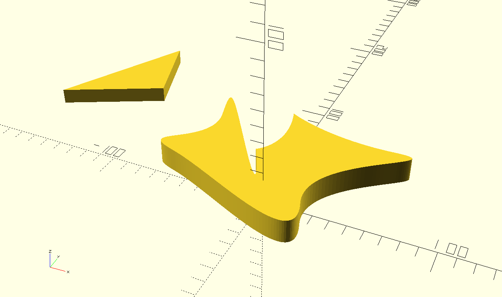

# svg_to_scad.py

## Description

A python script to convert simple SVG files into a list of coordinates.

## Features

- Allows fine-grained control over the number of samples for Bezier curves and arcs

- Capability to output the results into a JSON file or a SCAD file wrapped into a polygon module.

- Flip capbilities

- Scale capilities

- Display graph to visualize the generated result

- Output final result dimensions

## Usage

### Input and output options

``` bash
python svg_to_scad.py --input demo/straight_lines.svg --output demo/straight_lines.json
```

``` results
Width: 60.292721, Height: 83.38827
Coordinates saved to demo/straight_lines.json
```

input/output:


### Close option

``` bash
python svg_to_scad.py -i demo/straight_lines.svg -o demo/straight_lines.json --close
```

``` results
Width: 60.292721, Height: 83.38827
Coordinates saved to demo/straight_lines.json
```

input/output:


### Flip option

``` bash
python svg_to_scad.py -i demo/straight_lines.svg -o demo/straight_lines.scad -c --flip x
```

```
Width: 60.292721, Height: 83.38827
Coordinates saved to demo/straight_lines.scad
```

input/output:


### Sampling option

``` bash
python svg_to_scad.py -i demo/bezier_curves.svg -o demo/bezier_curves.scad -c -f x --number-samples 10
```

``` results
Width: 141.81590968696838, Height: 99.41870528120708
Coordinates saved to demo/bezier_curves.scad
```

input/output:


### Scale option

``` bash
python svg_to_scad.py -i demo/bezier_curves.svg -o demo/bezier_curves.scad -c -f x -n 15 --scale 300:
```

``` results
Width: 300.0, Height: 210.84904916813773
Coordinates saved to demo/bezier_curves.scad
```

input/output:


### help menu

For further details on options, use the help menu:

``` bash
python svg_to_scad.py --help
```

## Usage example in OpenSCAD

``` openscad
// Load the generated SCAD files
use <straight_lines.scad>
use <bezier_curves.scad>

// Use the polygon modules defined in the included files
translate([-200, -40, 0]) {
    linear_extrude(10)
    straight_lines();
}

translate([-100, -100, 0]) {
    linear_extrude(15)
    bezier_curves();
}
```

Results:


